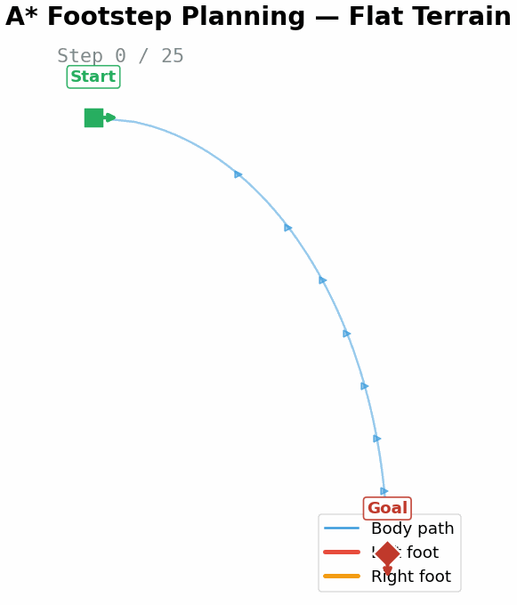
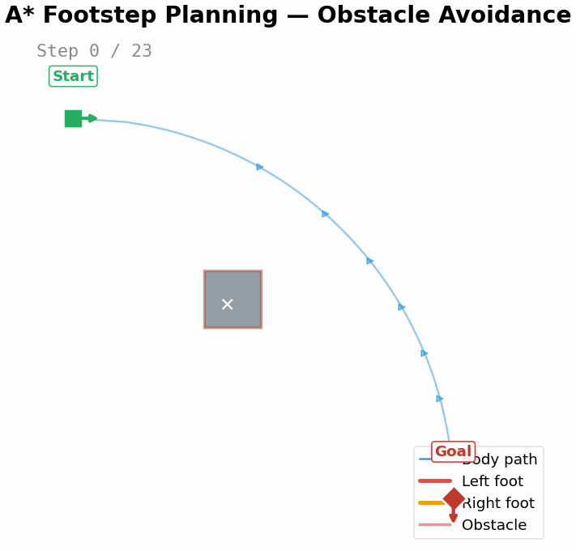
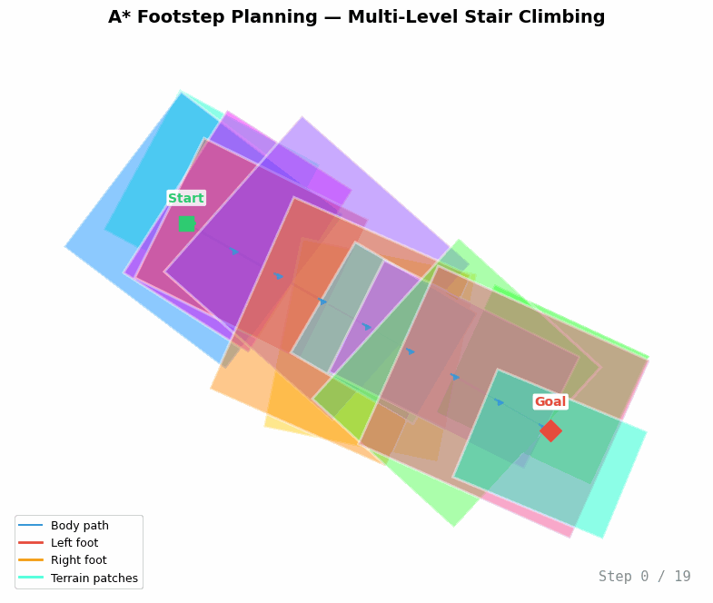

<div align="center">


# AStarFootstepPlanner

**A\* algorithm-based footstep planner for humanoid robots in C++**

[](https://github.com/Mr-tooth/AStarFootstepPlanner/actions/workflows/ci.yml)
[](LICENSE)
[](https://en.cppreference.com/w/cpp/11)
[](https://cmake.org/)
[](https://github.com/Mr-tooth/Heuclid)

[中文](README_CN.md)

⭐ **If you find this project useful, please give it a star!** It helps others discover this project and supports open-source robotics development.

</div>

---

## Overview

**AStarFootstepPlanner** is a C++ library that plans optimal footstep sequences for humanoid robots navigating complex terrains. It implements an A* graph search algorithm to find feasible, near-optimal paths from start to goal poses while satisfying kinematic and environmental constraints.

This project is a C++ reimplementation of the core algorithms from the [IHMC Footstep Planning](https://github.com/ihmcrobotics/ihmc-open-robotics-software/tree/develop/ihmc-footstep-planning) framework (originally Java), as described in the IEEE Humanoids 2019 paper.

**Key capabilities:**

- A* graph search over discrete footstep configurations
- Parameter-based step expansion with ideal step computation
- Kinematic constraint checking (reachability, stability)
- Environmental constraints (stair regions, obstacle avoidance)
- Configurable cost functions (distance, yaw, transition penalties)
- Optional matplotlib-based visualization for debugging and analysis

## Demo

<table>
<tr>
<td align="center" width="50%"><b>Flat Terrain</b><br></td>
<td align="center" width="50%"><b>Obstacle Avoidance</b><br></td>
</tr>
<tr>
<td colspan="2" align="center"><b>Stepping Stones</b><br></td>
</tr>
<tr>
<td colspan="2" align="center">

| Demo | Steps | Description |
|------|-------|-------------|
| **Flat** | 25 | A* with ellipsoid body path guidance |
| **Obstacle** | 23 | Footsteps detour around an obstacle polygon |
| **Stones** | 11 | Base plane (h=0) + elevated stepping stones (5–15 cm) |

</td>
</tr>
</table>

## Quick Start

```bash
# Clone with submodules
git clone --recursive https://github.com/Mr-tooth/AStarFootstepPlanner.git
cd AStarFootstepPlanner

# Build (all dependencies auto-fetched on first configure)
cmake -B build -DBUILD_TESTING=ON
cmake --build build

# Run tests
ctest --test-dir build
```

> **That's it!** Heuclid, Eigen3, and LBlocks are automatically fetched if not found on your system. First build may take a few minutes to download dependencies.

## Using in Your Project

### CMake Integration

```cmake
# Option 1: add_subdirectory
add_subdirectory(path/to/AStarFootstepPlanner)
target_link_libraries(your_target PRIVATE FootstepPlannerLJH)

# Option 2: find_package (after installing)
find_package(FootstepPlannerLJH REQUIRED)
target_link_libraries(your_target PRIVATE FootstepPlannerLJH::FootstepPlannerLJH)
```

### Code Example

```cpp
#include <FootstepPlannerLJH/AStarFootstepPlanner.h>

using namespace ljh::path::footstep_planner;

int main()
{
   // Define start and goal poses (x, y, z, yaw, pitch, roll)
   Pose3D<double> startPose(0.0, 0.0, 0.0, 0.0, 0.0, 0.0);
   Pose3D<double> goalPose(2.0, 0.5, 0.0, 0.3, 0.0, 0.0);
   Pose2D<double> goalPose2D(2.0, 0.5, 0.3);

   // Create planner and run A* search
   AStarFootstepPlanner planner(goalPose2D, goalPose, startPose);
   planner.doAStarSearch();

   // Retrieve planned footstep sequence
   auto footsteps = planner.getAccurateFootstepSeries();
   for (const auto& step : footsteps)
   {
      // Process each footstep...
   }

   return 0;
}
```

## Architecture

```
┌─────────────────────────────────────────────────────────────┐
│                  AStarFootstepPlanner                       │
│                     (A* Main Loop)                          │
├──────────┬──────────┬──────────────┬────────────────────────┤
│  Step    │  Step    │   Step       │  Completion            │
│ Expansion│  Cost    │ Constraints  │  Checker               │
├──────────┼──────────┼──────────────┼────────────────────────┤
│Parameter │Heuristic │ StairRegion  │ Distance + Yaw         │
│Based     │Calculator│ Collision    │ Proximity              │
├──────────┴──────────┴──────────────┴────────────────────────┤
│              Simple2DBodyPathPlanner                        │
│               (Body Path Guidance)                          │
├─────────────────────────────────────────────────────────────┤
│                      Heuclid v2.4                           │
│      (Pose, Vector, ConvexPolygon, PolygonTools)            │
├─────────────────────────────────────────────────────────────┤
│                   Eigen3 (Linear Algebra)                   │
└─────────────────────────────────────────────────────────────┘

Optional: matplotlib_cpp ──► PlotChecker (Visualization)
           LBlocks ────────► Block (Modularization Wrapper)
```

### Component Mapping (C++ ↔ IHMC Java)

| C++ Component | IHMC Java Equivalent | Description |
|---------------|---------------------|-------------|
| `AStarFootstepPlanner` | `AStarFootstepPlanner` | A* search main loop |
| `ParameterBasedStepExpansion` | `ParameterBasedStepExpansion` | Step expansion strategy |
| `IdealstepCalculator` | `IdealStepCalculator` | Nominal step position |
| `FootstepCostCalculator` | `FootstepCostCalculator` | Step cost evaluation |
| `HeuristicCalculator` | `FootstepPlannerHeuristicCalculator` | A* heuristic |
| `StepConstraintCheck` | `HeightMapFootstepChecker` | Environmental constraints |
| `Simple2DBodyPathHolder` | `WaypointDefinedBodyPathPlanHolder` | Body path guidance |

## Dependencies

All dependencies are **automatically fetched** if not found on your system. No manual installation required for basic usage!

| Dependency | Version | Required | Auto-fetched |
|------------|---------|----------|--------------|
| [Heuclid](https://github.com/Mr-tooth/Heuclid) | v2.4+ | ✅ Yes | ✅ (GitHub) |
| [Eigen3](https://eigen.tuxfamily.org/) | 3.3+ | ✅ Yes | ✅ (GitLab) |
| [LBlocks](https://github.com/hexb66/LBlocks) | latest | ✅ Yes | ✅ (submodule) |
| [matplotlib_cpp](https://github.com/hexb66/matplotlib-cpp) | — | ❌ Optional | ❌ (needs Python) |

To use pre-installed dependencies instead of auto-fetching, set `CMAKE_PREFIX_PATH`:
```bash
cmake -B build -DCMAKE_PREFIX_PATH="/path/to/Heuclid;/path/to/Eigen3"
```

## Building from Source

### Requirements

- CMake 3.22+
- C++11 compliant compiler (GCC 5+, Clang 3.8+, MSVC 2017+)
- Internet connection (for first-time dependency fetch)

All C++ dependencies (Heuclid, Eigen3, LBlocks) are **automatically fetched** on first configure. No manual installation needed!

### Platform-Specific Setup

**Ubuntu / Debian:**
```bash
sudo apt install build-essential cmake git libeigen3-dev
```

**macOS:**
```bash
brew install cmake eigen
```

**Windows (MSVC):**
- Install [Visual Studio 2017+](https://visualstudio.microsoft.com/) with C++ workload
- Install [CMake](https://cmake.org/download/)
- Install [Eigen3](https://eigen.tuxfamily.org/) (via vcpkg or manual)

### Build Options

| Option | Default | Description |
|--------|---------|-------------|
| `BUILD_TESTING` | `ON` | Build test executables |

### Enabling Visualization (matplotlib_cpp)

<details>
<summary><b>Ubuntu</b></summary>

```bash
sudo apt install python3-dev python3-matplotlib python3-numpy
```
</details>

<details>
<summary><b>macOS</b></summary>

```bash
brew install python3
pip3 install matplotlib numpy
```
</details>

<details>
<summary><b>Windows (MSVC)</b></summary>

1. Install [Python 3.8+](https://python.org) — check **"Add Python to PATH"**
2. Install packages:
   ```cmd
   pip install matplotlib numpy
   ```
3. Set environment variable:
   ```cmd
   set Python3_ROOT_DIR=C:\Users\%USERNAME%\AppData\Local\Programs\Python\Python312
   ```
4. Build:
   ```cmd
   cmake -B build -DPython3_ROOT_DIR=%Python3_ROOT_DIR%
   cmake --build build --config Release
   ```

**Note**: matplotlib_cpp requires linking with `/MT` (static CRT) on MSVC. This is handled automatically by the build system when matplotlib_cpp is detected.
</details>

When matplotlib_cpp is **not** found, the `PlotChecker` visualization module is automatically disabled. All core planning functionality remains available.

## Project Structure

```
AStarFootstepPlanner/
├── include/FootstepPlannerLJH/
│   ├── AStarFootstepPlanner.h      # Main planner class
│   ├── AStarSearch.h               # A* algorithm (generic)
│   ├── FootstepplannerBasic.h      # Footstep types (DiscreteFootstep, AccurateFootstep)
│   ├── parameters.h                # Planner parameters
│   ├── Block/                      # LBlocks integration wrapper
│   ├── PlotCheck/                  # Visualization (matplotlib)
│   ├── SimpleBodyPathPlanner/      # Body path guidance
│   ├── StepCheck/                  # Completion checking
│   ├── StepConstraints/            # Environmental constraints
│   ├── StepCost/                   # Cost and heuristic functions
│   └── StepExpansion/              # Step expansion strategies
├── src/                            # Implementation files
├── test/                           # Test executables
└── external/                       # Git submodules (LBlocks)
```

## Roadmap

- [ ] Snap & Wiggle step refinement (matching IHMC's `FootstepSnapAndWiggler`)
- [ ] Heightmap-based terrain awareness
- [ ] Body path planning enhancement
- [ ] ROS 2 integration
- [ ] Performance benchmarking

## Citation

If you use this library in your research or projects, please cite:

```bibtex
@software{astarfootstepplanner,
  title = {AStarFootstepPlanner: A* Footstep Planner for Humanoid Robots},
  author = {Junhang Lai},
  year = {2026},
  url = {https://github.com/Mr-tooth/AStarFootstepPlanner}
}
```

The underlying algorithm is based on:

```bibtex
@inproceedings{ihmc_footstep_2019,
  title={Footstep Planning for Autonomous Walking Over Rough Terrain},
  author={Griffin, Robert J and Wiedebach, Georg and Bertrand, Sylvain and Leonessa, Alexander and Pratt, Jerry},
  booktitle={IEEE-RAS International Conference on Humanoid Robots},
  year={2019},
  organization={IEEE},
  doi={1109/Humanoids43949.2019.9035046}
}
```

## Related Projects

| Project | Description |
|---------|-------------|
| [Heuclid](https://github.com/Mr-tooth/Heuclid) | C++ geometry library (IHMC Euclid port) |
| [IHMC Euclid](https://github.com/ihmcrobotics/euclid) | Original Java geometry library |
| [IHMC Footstep Planning](https://github.com/ihmcrobotics/ihmc-open-robotics-software) | Original Java footstep planner |

## Contributing

See [CONTRIBUTING.md](CONTRIBUTING.md) for guidelines.

## License

Licensed under the [Apache License 2.0](LICENSE).

## Author

**Junhang Lai (赖俊杭)** — [GitHub](https://github.com/Mr-tooth)

---

_This library's upstream dependency [Heuclid](https://github.com/Mr-tooth/Heuclid) provides the geometric primitives used throughout._
