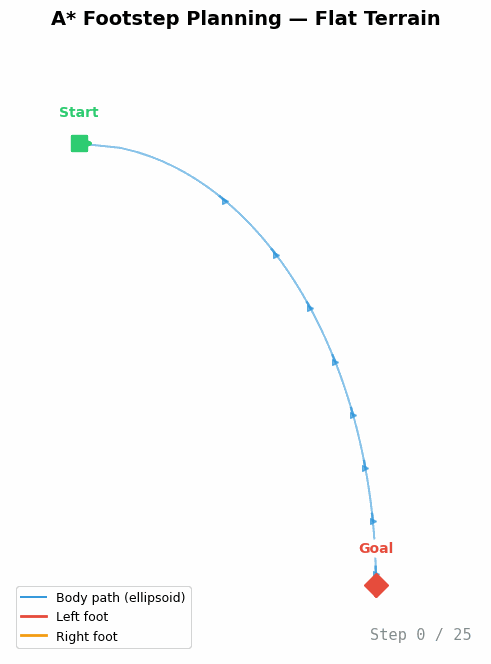
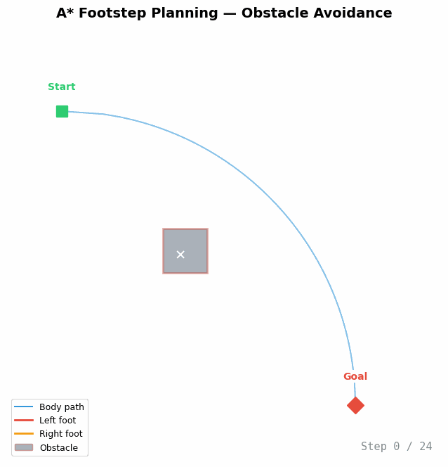

<div align="center">


# AStarFootstepPlanner

**基于 A* 算法的人形机器人落脚点规划器（C++ 实现）**

[](https://github.com/Mr-tooth/AStarFootstepPlanner/actions/workflows/ci.yml)
[](LICENSE)
[](https://en.cppreference.com/w/cpp/11)
[](https://cmake.org/)
[](https://github.com/Mr-tooth/Heuclid)

[English](README.md)

⭐ **如果这个项目对您有帮助，请给一个 Star！** 这有助于更多人发现本项目，支持开源机器人发展。

</div>

---

## 概述

**AStarFootstepPlanner** 是一个 C++ 库，用于在复杂地形上为仿人机器人规划最优落脚点序列。它采用 A* 图搜索算法，在满足运动学和环境约束的前提下，找到从起始姿态到目标姿态的可行近最优路径。

本项目是对 [IHMC 落脚点规划框架](https://github.com/ihmcrobotics/ihmc-open-robotics-software/tree/develop/ihmc-footstep-planning)（Java 实现）核心算法的 C++ 移植，相关算法描述见 IEEE Humanoids 2019 论文。

**核心能力：**

- 基于 A* 图搜索的离散落脚点配置空间搜索
- 基于参数的步态扩展策略，含理想步位置计算
- 运动学约束检查（可达性、稳定性）
- 环境约束（楼梯区域、障碍物避让）
- 可配置代价函数（距离、偏航角、步态转换惩罚）
- 可选的 matplotlib 可视化，用于调试和分析

## 演示


### 平地场景

<p align="center">
  
</p>

> A* 落脚点规划：从起点（蓝色方块）到目标点（红色菱形）。红色=左脚，橙色=右脚。25 个离散落脚点均匀分布在椭圆身体路径（蓝色曲线，带方向箭头）两侧。

### 障碍物避障

<p align="center">
  
</p>

> 落脚点绕过放置在身体路径上的灰色障碍物块。规划器会拒绝与障碍物多边形相交的落脚点，产生自然的绕行路径（24 步）。

- ✅ 平地：起点 → 终点落脚点序列
- ✅ 障碍物回避：绕开禁止区域
- ⏳ 楼梯攀爬：楼梯约束下的落脚点规划
> - 障碍物避让：绕过禁区的路径规划
> - 楼梯场景：约束条件下的楼梯落脚点规划

## 快速开始

```bash
# 克隆（含子模块）
git clone --recursive https://github.com/Mr-tooth/AStarFootstepPlanner.git
cd AStarFootstepPlanner

# 构建（首次配置时自动获取所有依赖）
cmake -B build -DBUILD_TESTING=ON
cmake --build build

# 运行测试
ctest --test-dir build
```

> **就这么简单！** Heuclid、Eigen3 和 LBlocks 在未找到时会自动下载。首次构建可能需要几分钟来获取依赖。

## 在项目中使用

### CMake 集成

```cmake
# 方式一：add_subdirectory
add_subdirectory(path/to/AStarFootstepPlanner)
target_link_libraries(your_target PRIVATE FootstepPlannerLJH)

# 方式二：find_package（安装后）
find_package(FootstepPlannerLJH REQUIRED)
target_link_libraries(your_target PRIVATE FootstepPlannerLJH::FootstepPlannerLJH)
```

### 代码示例

```cpp
#include <FootstepPlannerLJH/AStarFootstepPlanner.h>

using namespace ljh::path::footstep_planner;

int main()
{
   // 定义起始和目标姿态 (x, y, z, yaw, pitch, roll)
   Pose3D<double> startPose(0.0, 0.0, 0.0, 0.0, 0.0, 0.0);
   Pose3D<double> goalPose(2.0, 0.5, 0.0, 0.3, 0.0, 0.0);
   Pose2D<double> goalPose2D(2.0, 0.5, 0.3);

   // 创建规划器并执行 A* 搜索
   AStarFootstepPlanner planner(goalPose2D, goalPose, startPose);
   planner.doAStarSearch();

   // 获取规划的落脚点序列
   auto footsteps = planner.getAccurateFootstepSeries();
   for (const auto& step : footsteps)
   {
      // 处理每个落脚点...
   }

   return 0;
}
```

## 架构

```
┌─────────────────────────────────────────────────────────────┐
│                  AStarFootstepPlanner                       │
│                    (A* 主搜索循环)                           │
├──────────┬──────────┬──────────────┬────────────────────────┤
│   步扩展  │  步代价   │   步约束检查  │     完成检查           │
├──────────┼──────────┼──────────────┼────────────────────────┤
│ Parameter│Heuristic │  StairRegion │   Distance + Yaw       │
│ Based    │Calculator│  Collision   │   Proximity            │
├──────────┴──────────┴──────────────┴────────────────────────┤
│              Simple2DBodyPathPlanner                        │
│                 (身体路径引导)                                │
├─────────────────────────────────────────────────────────────┤
│                      Heuclid v2.0                           │
│           (Pose, Vector, ConvexPolygon, Tools)              │
├─────────────────────────────────────────────────────────────┤
│                   Eigen3 (线性代数)                          │
└─────────────────────────────────────────────────────────────┘

可选依赖: matplotlib_cpp ──► PlotChecker (可视化)
          LBlocks ────────► Block (模块化封装)
```

### 组件对照（C++ ↔ IHMC Java）

| C++ 组件 | IHMC Java 对应 | 说明 |
|----------|---------------|------|
| `AStarFootstepPlanner` | `AStarFootstepPlanner` | A* 搜索主循环 |
| `ParameterBasedStepExpansion` | `ParameterBasedStepExpansion` | 步扩展策略 |
| `IdealStepCalculator` | `IdealStepCalculator` | 理想步位置计算 |
| `FootstepCostCalculator` | `FootstepCostCalculator` | 步代价评估 |
| `HeuristicCalculator` | `FootstepPlannerHeuristicCalculator` | A* 启发式函数 |
| `StepConstraintCheck` | `HeightMapFootstepChecker` | 环境约束检查 |
| `Simple2DBodyPathHolder` | `WaypointDefinedBodyPathPlanHolder` | 身体路径引导 |

## 依赖

所有依赖在未找到时会**自动获取**，无需手动安装！

| 依赖 | 版本 | 必需 | 自动获取 |
|------|------|------|----------|
| [Heuclid](https://github.com/Mr-tooth/Heuclid) | v2.0+ | ✅ | ✅ (GitHub) |
| [Eigen3](https://eigen.tuxfamily.org/) | 3.3+ | ✅ | ✅ (GitLab) |
| [LBlocks](https://github.com/hexb66/LBlocks) | 最新 | ✅ | ✅ (submodule) |
| [matplotlib_cpp](https://github.com/hexb66/matplotlib-cpp) | — | ❌ 可选 | ❌ (需 Python) |

如需使用已安装的依赖而非自动获取，设置 `CMAKE_PREFIX_PATH`：
```bash
cmake -B build -DCMAKE_PREFIX_PATH="/path/to/Heuclid;/path/to/Eigen3"
```

## 从源码构建

### 环境要求

- CMake 3.22+
- C++11 编译器（GCC 5+, Clang 3.8+, MSVC 2017+）
- 网络连接（首次获取依赖时需要）

所有 C++ 依赖（Heuclid、Eigen3、LBlocks）在首次配置时**自动获取**，无需手动安装！

### 各平台依赖安装

**Ubuntu / Debian:**
```bash
sudo apt install build-essential cmake git libeigen3-dev
```

**macOS:**
```bash
brew install cmake eigen
```

**Windows (MSVC):**
- 安装 [Visual Studio 2017+](https://visualstudio.microsoft.com/)（含 C++ 工作负载）
- 安装 [CMake](https://cmake.org/download/)
- 安装 [Eigen3](https://eigen.tuxfamily.org/)（通过 vcpkg 或手动）

### 启用可视化（matplotlib_cpp）

<details>
<summary><b>Ubuntu</b></summary>

```bash
sudo apt install python3-dev python3-matplotlib python3-numpy
```
</details>

<details>
<summary><b>macOS</b></summary>

```bash
brew install python3
pip3 install matplotlib numpy
```
</details>

<details>
<summary><b>Windows (MSVC)</b></summary>

1. 安装 [Python 3.8+](https://python.org) — 勾选 **"Add Python to PATH"**
2. 安装依赖包：
   ```cmd
   pip install matplotlib numpy
   ```
3. 设置环境变量：
   ```cmd
   set Python3_ROOT_DIR=C:\Users\%USERNAME%\AppData\Local\Programs\Python\Python312
   ```
4. 构建：
   ```cmd
   cmake -B build -DPython3_ROOT_DIR=%Python3_ROOT_DIR%
   cmake --build build --config Release
   ```

**注意**：matplotlib_cpp 在 MSVC 下要求使用 `/MT`（静态 CRT）链接。构建系统在检测到 matplotlib_cpp 时会自动处理。
</details>

未检测到 matplotlib_cpp 时，`PlotChecker` 可视化模块会自动禁用，所有核心规划功能不受影响。

## 项目结构

```
AStarFootstepPlanner/
├── include/FootstepPlannerLJH/
│   ├── AStarFootstepPlanner.h      # 主规划器类
│   ├── AStarSearch.h               # A* 算法（通用实现）
│   ├── FootstepplannerBasic.h      # 落脚点类型定义
│   ├── parameters.h                # 规划参数配置
│   ├── Block/                      # LBlocks 集成封装
│   ├── PlotCheck/                  # matplotlib 可视化
│   ├── SimpleBodyPathPlanner/      # 身体路径引导
│   ├── StepCheck/                  # 完成条件检查
│   ├── StepConstraints/            # 环境约束检查
│   ├── StepCost/                   # 代价与启发式函数
│   └── StepExpansion/              # 步扩展策略
├── src/                            # 实现文件
├── test/                           # 测试
└── external/                       # Git 子模块（LBlocks）
```

## 路线图

- [ ] Snap & Wiggle 步态微调（匹配 IHMC 的 `FootstepSnapAndWiggler`）
- [ ] 基于高度图的地形感知
- [ ] 身体路径规划增强
- [ ] ROS 2 集成
- [ ] 性能基准测试

## 引用

如果您的研究或项目使用了本库，请引用：

```bibtex
@software{astarfootstepplanner,
  title = {AStarFootstepPlanner: A* Footstep Planner for Humanoid Robots},
  author = {Junhang Lai},
  year = {2026},
  url = {https://github.com/Mr-tooth/AStarFootstepPlanner}
}
```

底层算法基于以下论文：

```bibtex
@inproceedings{ihmc_footstep_2019,
  title={Footstep Planning for Autonomous Walking Over Rough Terrain},
  author={Griffin, Robert J and Wiedebach, Georg and Bertrand, Sylvain and Leonessa, Alexander and Pratt, Jerry},
  booktitle={IEEE-RAS International Conference on Humanoid Robots},
  year={2019},
  organization={IEEE},
  doi={1109/Humanoids43949.2019.9035046}
}
```

## 相关项目

| 项目 | 说明 |
|------|------|
| [Heuclid](https://github.com/Mr-tooth/Heuclid) | C++ 几何数学库（IHMC Euclid 移植） |
| [IHMC Euclid](https://github.com/ihmcrobotics/euclid) | 原版 Java 几何库 |
| [IHMC Footstep Planning](https://github.com/ihmcrobotics/ihmc-open-robotics-software) | 原版 Java 落脚点规划器 |

## 贡献

参见 [CONTRIBUTING.md](CONTRIBUTING.md) 了解贡献指南。

## 许可证

本项目基于 [Apache License 2.0](LICENSE) 开源。

## 作者

**Junhang Lai (赖俊杭)** — [GitHub](https://github.com/Mr-tooth)

---

_本库的上游依赖 [Heuclid](https://github.com/Mr-tooth/Heuclid) 提供了全部几何基础类型。_
